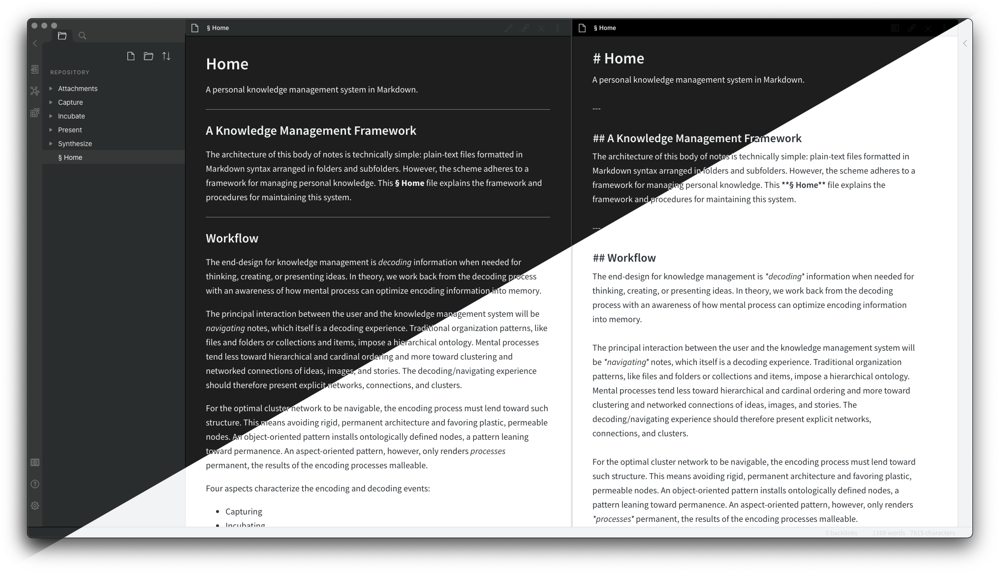

# Obsidian Big Sur Aesthetic

A theme for Obsidian based on macOS Big Sur's interface styles.

## Installation

1. Download theme.css to your Obsidian vault folder
2. In Obsidian, click Settings -> Plugins make sure `Custom CSS` is enabled
3. Select light or dark theme in Obsidian's appearance settings.